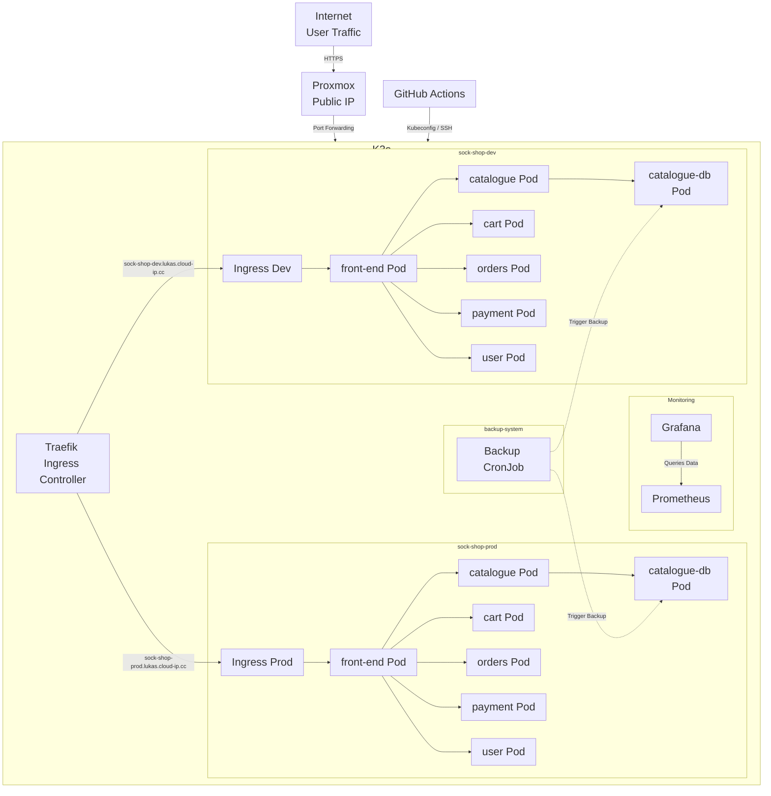

# Sock Shop

A minimal microservices demo for running the Sock Shop application on Kubernetes.

## Overview

This folder contains Kubernetes manifests and resources for deploying the Sock Shop sample application. The documentation explains how to deploy locally and how to use the GitHub Actions CI/CD pipeline.

## Architecture Diagram



## Architecture Explanation

1. **Traffic Flow**:
   - User traffic comes from the internet via HTTPS
   - Hits the Proxmox server's public IP address
   - Port forwarding routes traffic to the K3s cluster
   - Traefik Ingress Controller receives the traffic
   - Based on the hostname, Traefik routes traffic to either `sock-shop-dev` or `sock-shop-prod` namespace
   - Traffic reaches the respective microservices pods

2. **Monitoring System**:
   - Prometheus collects metrics from the cluster
   - Grafana queries Prometheus for data and visualizes it in dashboards

3. **Backup System**:
   - Backup CronJob runs daily to back up the databases
   - It connects to both `catalogue-db` in `sock-shop-dev` and `sock-shop-prod` namespaces
   - Backups are stored on persistent storage for 7 days

4. **GitHub Actions CI/CD**:
   - GitHub Actions workflows deploy to the cluster using kubeconfig secrets
   - Changes pushed to `develop` branch trigger deployment to `sock-shop-dev`
   - Changes pushed to `main` branch trigger deployment to `sock-shop-prod`

## Project File Structure

```
Sock_Shop/
├── .github/
│   └── workflows/
│       └── ci-cd.yaml          # GitHub Actions workflow for CI/CD
├── Kubernetes/
│   ├── namespace-dev.yaml      # Development namespace manifest
│   ├── namespace-prod.yaml     # Production namespace manifest
│   ├── deployment-dev.yaml     # Development environment deployment manifests
│   ├── deployment-prod.yaml    # Production environment deployment manifests
│   ├── ingress-dev.yaml        # Development Ingress with TLS
│   ├── ingress-prod.yaml       # Production Ingress with TLS
│   └── cluster-issuer.yaml     # Let's Encrypt ClusterIssuer for cert-manager
├── Monitoring/
│   ├── 00-monitoring-ns.yaml   # Monitoring namespace
│   ├── 01-07-prometheus-*.yaml # Prometheus resources
│   ├── 08-prometheus-exporter-*.yaml # Node Exporter resources
│   ├── 10-14-kube-state-*.yaml # Kube State Metrics resources
│   ├── 20-23-grafana-*.yaml    # Grafana resources
│   └── 24-26-prometheus-node-exporter-*.yaml # Prometheus Node Exporter
├── secrets/
│   └── catalogue-db-secret.example.yaml # Example secret template
├── Images/
│   └── Grafana Dashboard Sock-Shop.png # Grafana dashboard screenshot
├── cronjob.yaml                # Daily database backup CronJob
├── .gitignore                  # Git ignore rules
└── README.md                   # This documentation file
```

## Requirements

- A Kubernetes cluster (kind, minikube, k3s, or a cloud provider)
- `kubectl` configured to access the target cluster
- For GitHub Actions deployment: a reachable Kubernetes API server and valid kubeconfig data stored as GitHub Secrets
- GitHub Actions repo secrets for database password injection: `MYSQL_ROOT_PASSWORD_DEV` and `MYSQL_ROOT_PASSWORD_PROD`

## Local Deployment

1. Clone the repository and change to this directory:

```bash
git clone <your-repo-url>
cd Sock_Shop
```

2. Create the database secret for the target namespace and deploy the development environment:

```bash
kubectl create secret generic catalogue-db-secret \
  --from-literal=MYSQL_ROOT_PASSWORD="your-dev-password" \
  -n sock-shop-dev
kubectl apply -f Kubernetes/namespace-dev.yaml -f Kubernetes/deployment-dev.yaml
```

3. Create the database secret for production and deploy the production environment:

```bash
kubectl create secret generic catalogue-db-secret \
  --from-literal=MYSQL_ROOT_PASSWORD="your-prod-password" \
  -n sock-shop-prod
kubectl apply -f Kubernetes/namespace-prod.yaml -f Kubernetes/deployment-prod.yaml
```

4. Verify the deployment:

```bash
kubectl get pods -n sock-shop-dev
kubectl get svc -n sock-shop-dev
kubectl get pods -n sock-shop-prod
kubectl get svc -n sock-shop-prod
```

## HTTPS with Let’s Encrypt

This application can be secured with HTTPS using cert-manager and Let’s Encrypt.

1. Install cert-manager:

```bash
kubectl apply -f https://github.com/cert-manager/cert-manager/releases/download/v1.13.0/cert-manager.yaml
```

2. Apply the Let's Encrypt ClusterIssuer:

```bash
kubectl apply -f Kubernetes/cluster-issuer.yaml
```

3. Deploy the Ingress with TLS enabled for both development and production:

```bash
kubectl apply -f Kubernetes/ingress-dev.yaml
kubectl apply -f Kubernetes/ingress-prod.yaml
```

4. Confirm the certificates are issued:

```bash
kubectl get certificate -n sock-shop-dev
kubectl describe certificate sockshop-dev-tls -n sock-shop-dev
kubectl get certificate -n sock-shop-prod
kubectl describe certificate sockshop-prod-tls -n sock-shop-prod
```


## Backup CronJob

The file `cronjob.yaml` defines a simple scheduled backup job that runs daily and stores compressed MySQL backups in the `backup-system` namespace.

To deploy the backup CronJob:

```bash
kubectl create namespace backup-system
kubectl create secret generic catalogue-db-secret \
  --from-literal=MYSQL_ROOT_PASSWORD="your-db-password" \
  -n backup-system
kubectl apply -f cronjob.yaml
```

To verify the backup schedule:

```bash
kubectl get cronjob -n backup-system
kubectl get jobs -n backup-system
```

The CronJob stores backups on the `backup-storage-pvc` claim and retains backups for 7 days.

## Rollback

To roll back to a previous application version, use Git to select the desired commit or tag, then reapply the older manifests.

Example rollback steps:

```bash
git checkout <previous-commit-or-tag>
kubectl apply -f Kubernetes/namespace-dev.yaml -f Kubernetes/deployment-dev.yaml
```

If you deploy from GitHub Actions, revert the branch or tag used for the release and re-run the workflow.

If stateful data is affected, restore the database from a backup file before redeploying the previous application version.

## GitHub Actions CI/CD

This repository includes a workflow at `.github/workflows/ci-cd.yaml` with the following behavior:

- `Test` job runs on pushes or pull requests to `main` and `develop` and validates YAML syntax.
- `deploy-dev` job runs only on the `develop` branch.
- `deploy-prod` job runs only on the `main` branch.

### Branch usage

- `develop`: deploys `Kubernetes/namespace-dev.yaml` and `Kubernetes/deployment-dev.yaml` using `KUBE_CONFIG_DATA_DEV`.
- `main`: deploys `Kubernetes/namespace-prod.yaml` and `Kubernetes/deployment-prod.yaml` using `KUBE_CONFIG_DATA_PROD`.

### Required GitHub Secrets

Configure the following repository secrets in GitHub Settings > Secrets:

- `KUBE_CONFIG_DATA_DEV`
- `KUBE_CONFIG_DATA_PROD`
- `MYSQL_ROOT_PASSWORD_DEV`
- `MYSQL_ROOT_PASSWORD_PROD`

Each kubeconfig secret must contain the Base64-encoded contents of a kubeconfig file that can access the target Kubernetes cluster.
The password secrets should contain the actual MySQL root password for the dev and prod namespaces.

### Generate the Base64 kubeconfig value

If your kubeconfig file is available locally, run:

```bash
cat /etc/rancher/k3s/k3s.yaml | base64 -w0
```

If `base64` does not support `-w0`, use:

```bash
cat /etc/rancher/k3s/k3s.yaml | base64 | tr -d '\n'
```

Then paste the resulting single-line string into the appropriate GitHub Secret.

### Important note for GitHub-hosted runners

If you use GitHub-hosted runners, the kubeconfig must point to a Kubernetes API server reachable from the runner.

Do not use a kubeconfig whose `server:` field is `https://127.0.0.1:6443` or `https://localhost:6443` unless the runner is self-hosted on the same machine as the cluster.

If your cluster is local and not reachable from GitHub-hosted runners, use a self-hosted runner in the same network or expose the API server over a reachable address.

### Local secret file handling

The repository includes `secrets/catalogue-db-secret.example.yaml` as an example, but the actual sensitive secret file should not be committed to Git. The workflow creates the Kubernetes secret from GitHub Actions secrets at deployment time, so the real password never needs to be stored in the repo.

## Monitoring (Prometheus & Grafana)

This repository includes monitoring manifests under the `Monitoring/` directory for deploying Prometheus and Grafana.

Quick steps to deploy and access monitoring:

1. Apply the monitoring manifests:

```bash
kubectl apply -f Monitoring/
```

2. Verify monitoring pods and services are running:

```bash
kubectl get pods -n monitoring
kubectl get svc -n monitoring
```

3. Port-forward services to access the UIs locally:

```bash
# Prometheus UI
kubectl -n monitoring port-forward svc/prometheus 9090:9090

# Grafana UI
kubectl -n monitoring port-forward svc/grafana 3000:80
```

4. Open the UIs in your browser:

- Prometheus: http://localhost:9090
- Grafana: http://localhost:3000

### Grafana Dashboards

- A working Node Exporter dashboard (ID `11074`, "Node Exporter Full") is available and displays host-level CPU/Memory/Disk metrics.
- To import it manually in Grafana: left menu → `+` → `Import` → enter `11074` → `Load` → select `Prometheus` as the data source → `Import`.
- Alternatively, browse `Dashboards` → `Manage` and search `Node Exporter` or `Node Exporter Full`.
- If panels show "No data", verify the data source (Grafana → Configuration → Data Sources → Prometheus) and click `Save & Test`.


